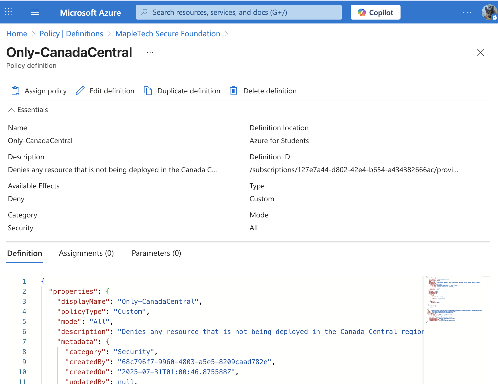
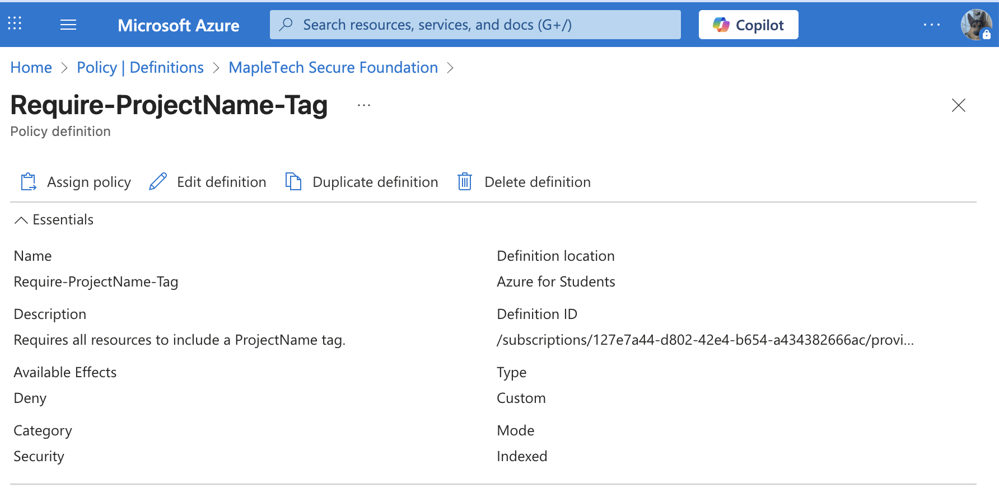
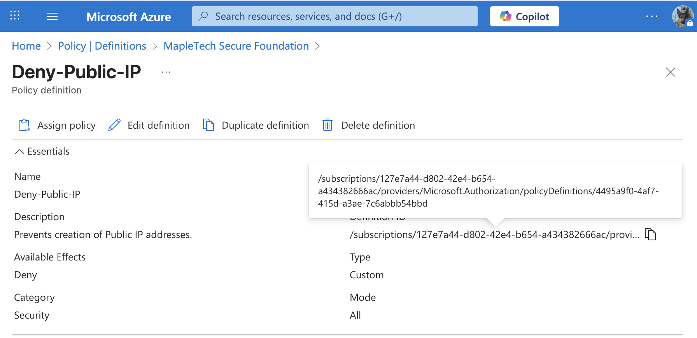
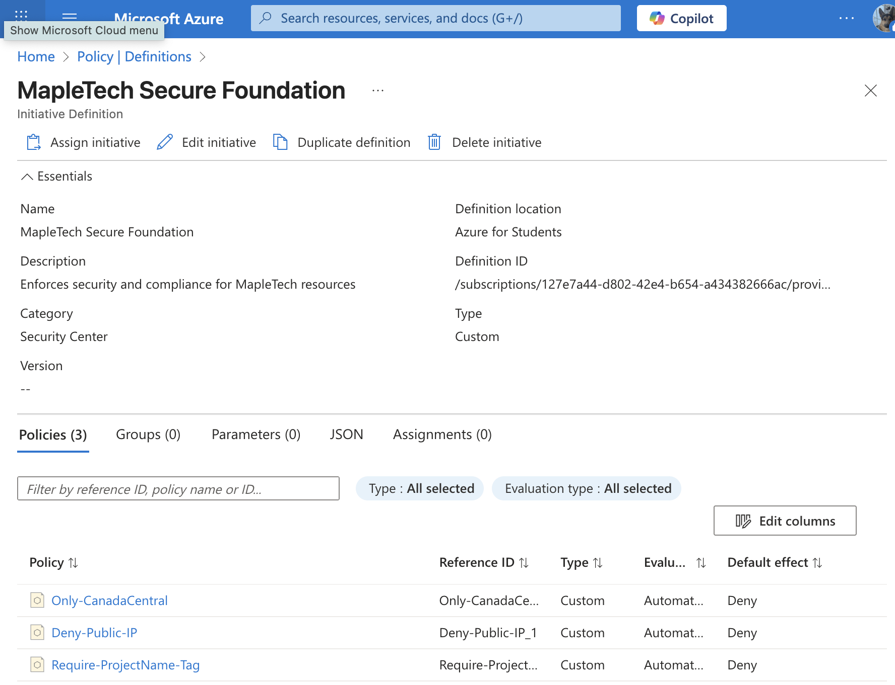
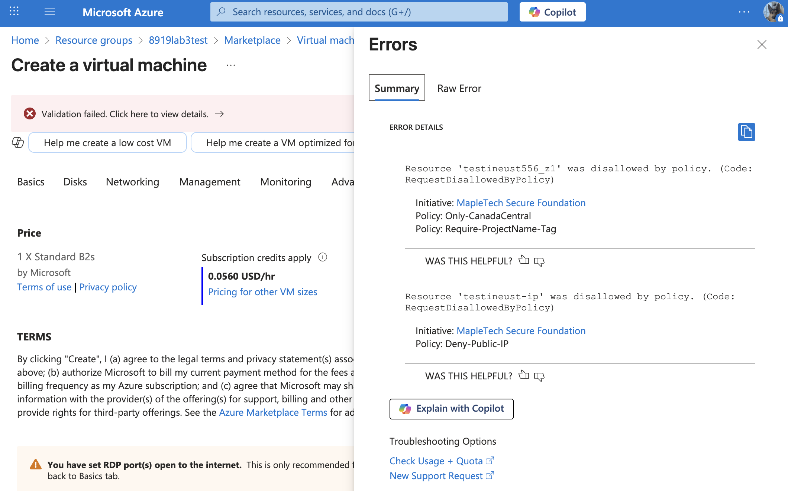
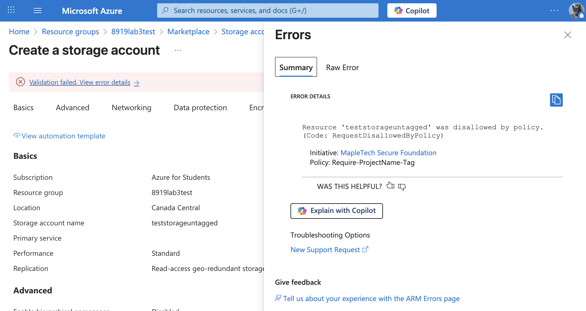
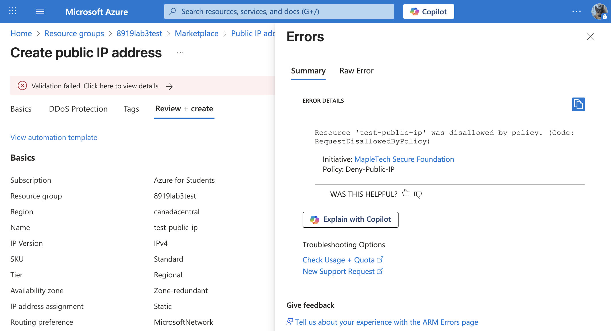
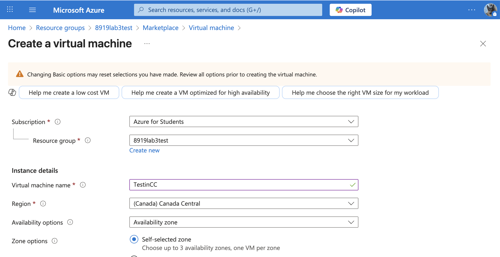
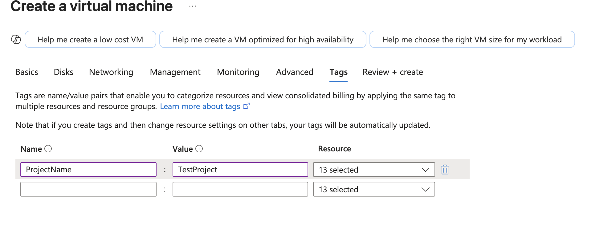
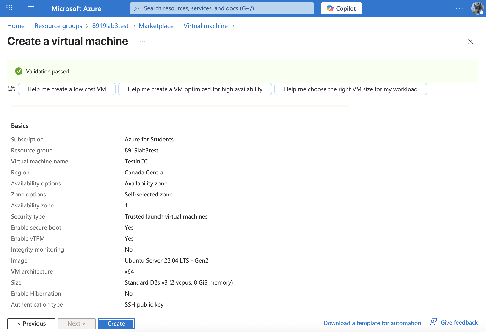

# Cloud Governance Gone Rogue – Azure Policy Lab

## 🎥 Video Demo

- [🔗 Watch Demo Video](https://youtu.be/vJmdlkQm9d8)  
---

## 🎯 Lab Objectives
- ✅ Create and assign **Azure Policies** and a **Policy Initiative**
- ✅ Enforce:
  - Region restriction to **Canada Central**
  - Mandatory tagging: `ProjectName`
  - No public IP addresses
- ✅ Test the enforcement with real deployment scenarios

---

## 🛡️ Policies Implemented

### 1. Region Lockdown
- **Name**: `Only-CanadaCentral`
- **Effect**: `Deny`
- **Description**: Denies any resource deployed outside of the Canada Central region.

### 2. Mandatory Tagging
- **Name**: `Require-ProjectName-Tag`
- **Effect**: `Deny`
- **Description**: Requires all Azure resources to have the `ProjectName` tag before deployment.

### 3. Block Public IPs
- **Name**: `Deny-Public-IP`
- **Effect**: `Deny`
- **Description**: Blocks creation of any Public IP addresses to improve network security posture.

---

## 📦 Policy Initiative

- **Name**: `MapleTech Secure Foundation`
- **Includes**: All 3 custom policies listed above
- **Category**: `Security`

---

## 🔒 Assignment Details

- **Assigned to**: Selected Resource Group
- **Enforcement Mode**: `Enforced (deny)`
- **Result**: Policies actively block non-compliant deployments

---

## 🧪 Test Cases & Results

| Action                                              | Expected Outcome | Result     |
|-----------------------------------------------------|------------------|------------|
| Deploy VM in East US                                | ❌ Denied         | ✅ Denied  |
| Deploy Storage Account without `ProjectName` tag    | ❌ Denied         | ✅ Denied  |
| Create a Public IP                                  | ❌ Denied         | ✅ Denied  |
| Deploy VM in Canada Central **with** `ProjectName`  | ✅ Allowed        | ✅ Allowed |

📸 Screenshots for each test case are available in the `/screenshots` folder.
### Deploy VM 

### Deploy Storage Account without `ProjectName` tag

### Create a Public IP

### Deploy VM in Canada Central **with** `ProjectName`

---
## ⚠️ Challenges and Lessons Learned

### 🧩 Challenges Faced
	1.	Policy Syntax and Definition Errors
	•	Writing custom policies in JSON required precision. Minor mistakes in policyRule or parameters sections often caused deployment failures or unexpected behavior.
	•	Example: A missing { bracket or incorrect field path would cause the policy to silently fail during assignment.
	2.	Policy Assignment Scope Confusion
	•	Initially, policies were incorrectly assigned at the subscription level instead of the resource group, causing unintentional enforcement across unrelated resources.
	•	This was resolved by carefully selecting the appropriate scope during assignment.

⸻

### 💡 Lessons Learned

	•	✅ Policy Initiatives Simplify Management: Grouping policies into initiatives allowed easier assignment and tracking of security baselines.
	•	✅ Use Built-in Policies When Possible: Azure provides many built-in policies that can be customized, reducing the need to write JSON from scratch.
	•	✅ Testing Is Critical: Each policy must be tested with real deployment scenarios to ensure correct enforcement and avoid false positives/negatives.

---

## Author
Shaoxian Duan
